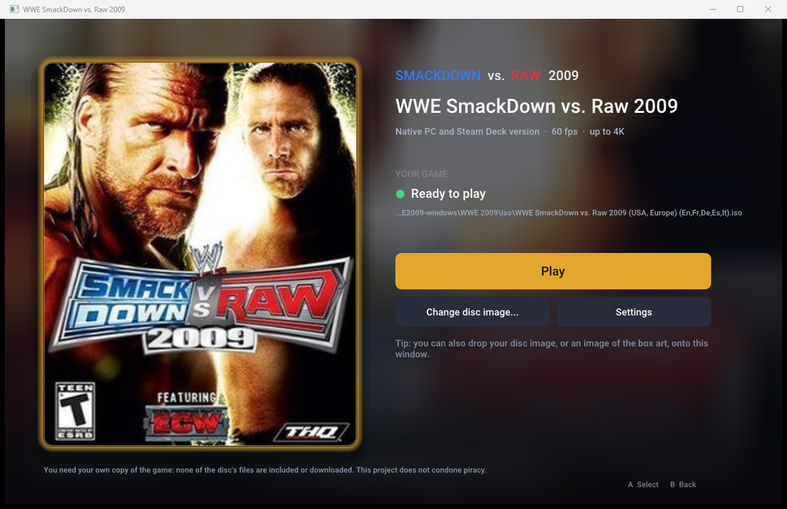

# WWE SmackDown vs. Raw 2009 — native PC & Steam Deck

The Xbox 360 version of **WWE SmackDown vs. Raw 2009**, running natively on Windows and on the
Steam Deck: no emulator. The game's own program is recompiled to run directly on your PC, and its
graphics go through a native Vulkan renderer, at 60 fps and up to 4K.

Its sister project is [WWE-SVR2008-Native](https://github.com/nefariousjosiah/WWE-SVR2008-Native).
Both use the same [launcher](https://github.com/nefariousjosiah/WWE-SVR-Launcher): put both releases in
one folder and it lists both games.

> **You need your own copy of the game.** This project contains none of the game's files and never
> downloads any. It only runs with a disc image (`.iso`) made from your own SvR 2009 disc. It does
> not condone piracy: please buy the game.



## Showcase

*Gameplay clips are on the way.*

## Features

- **Native, not emulated.** The game's PowerPC code is statically recompiled to x86-64
  ([ReXGlue](https://github.com/rexglue/rexglue-sdk)), and the game's own Direct3D calls are drawn
  by a native Vulkan renderer (adapted from [re:Blue](https://github.com/zolaware/reblue)) with
  the game's shaders recompiled ahead of time. No GPU emulation.
- **60 fps** in menus and matches, using the game's own 60 fps mode so game speed stays right
  (the original 30 fps is one click away).
- **Up to 4K.** Internal resolution follows your screen: 1440p on 1080p and 1440p monitors, 4K on
  4K monitors, 720p on the Steam Deck. Or pick 720p / 1440p / 4K yourself. 16x anisotropic
  filtering.
- **Steam Deck** through Proton: 720p at 60 fps, the correct 16:9 shape (or stretched to fill).
- **The launcher** finds your disc images, unlocks the games you have, and keeps per-game settings,
  your box art and controller navigation.
- **Controllers** (Xbox, PlayStation, Switch Pro, the Deck's controls) through SDL; the keyboard
  works as a controller too.

## What you need

- **Your own SvR 2009 disc image**, USA / Europe release (it is one release for both regions:
  title ID `54510826`, media ID `7AFA4596`, about 7.3 GB). Other releases are recognised and
  reported, but not supported yet.
- **Windows 10 or 11, 64-bit**, and a graphics card with **Vulkan** support (AMD, NVIDIA or Intel,
  with a recent driver). Or a **Steam Deck**.
- About 250 MB for the program, plus your disc image.

## Windows: install and play

1. Download `WWE-SVR2009-Native-v<version>-Windows-and-SteamDeck.zip` from the
   [Releases](https://github.com/nefariousjosiah/WWE-SVR2009-Native/releases) page (under
   *Assets*; not *Source code*, which is the developer source without `Launcher.exe`).
2. Extract it to a folder of its own, for example `C:\Games\WWE-SvR-Native`
   (not inside `Program Files`).
3. Copy your disc image into the `isos` folder there.
4. Run `Launcher.exe`. The SmackDown vs. Raw 2009 card says **Ready**: press **Play**.

That's it. A few things worth knowing:

- **No `isos` folder copy needed:** you can also drag the `.iso` onto the launcher window, or
  press **Locate your copy...** and pick it wherever it is. The launcher remembers it.
- **Settings** (button on the card): resolution (Auto, 720p, 1440p, 4K), fullscreen or window,
  60 or 30 fps, screen shape. They are saved per game.
- **Box art:** drag an image of the cover onto the card (or *Settings > Box art*). None is
  included, since it is the publisher's artwork.
- **"Windows protected your PC"**: the program isn't code-signed. Click *More info* and then
  *Run anyway*.
- **Quitting:** close the game window (Alt+F4 or the close button); the launcher comes back.
- **Saves** live in `games\svr2009\userdata`. Back that folder up to keep your career and
  created superstars.

### Controls

A controller is recommended; plug it in before starting. On the keyboard (rebind with **F4** in
game):

| Controller | Keyboard | | Controller | Keyboard |
|---|---|---|---|---|
| A | Space / ; | | Left stick | W A S D |
| B | Backspace / ' | | Right stick | Arrow keys |
| X | L | | D-pad | Shift + arrow keys |
| Y | P | | LB / RB | 1 / 3 |
| Start | Enter / X | | LT / RT | Q / E |
| Back | Tab / Z | | Stick presses | F / K |

**F2** shows or hides the FPS counter.

## Steam Deck: install and play

The Windows release runs on the Deck through Proton, Steam's compatibility layer. It holds 60 fps.

**In Desktop Mode** (press the Steam button, *Power*, *Switch to Desktop*):

1. **Get the release.** Download `WWE-SVR2009-Native-v<version>-Windows-and-SteamDeck.zip`
   (under *Assets*, not *Source code*) with the browser, or copy it
   over from your PC (USB drive, microSD card or network share).
2. **Extract it.** In the *Dolphin* file manager, make a folder such as
   `/home/deck/Games/WWE-SvR-Native`, right-click the zip, *Extract*, *Extract archive to...*, and
   choose that folder. (A microSD card works too.)
3. **Add your disc image.** Copy your `.iso` into the `isos` folder inside it.
4. **Add it to Steam.** Open Steam (desktop), then *Games* > *Add a Non-Steam Game to My
   Library...* > *Browse...*. Set the file type filter to *All files*, pick `Launcher.exe` in your
   folder, then *Add Selected Programs*.
5. **Turn on Proton.** In your library, right-click *Launcher* > *Properties...* >
   *Compatibility*, tick *Force the use of a specific Steam Play compatibility tool* and choose
   **Proton Experimental** (or the newest Proton). While you are there you can rename the
   shortcut, for example to *WWE SmackDown vs. Raw 2009*.

**Back in Game Mode** (the *Return to Gaming Mode* icon on the desktop):

6. Start it from *Library* > *Non-Steam*. The launcher opens fullscreen: pick the game with the
   D-pad and press **A**. Quitting the game brings you back to the launcher.

Notes for the Deck:

- **The first start** takes a little longer while Proton sets itself up.
- **Black bars:** the game is 16:9 and the Deck's screen is 16:10, so there are thin bars above
  and below. *Settings* > *Screen shape* > *Stretch to fill* removes them (the picture gets a
  little taller).
- **Controls:** the Deck's built-in controls work as an Xbox controller with Steam's default
  layout.
- **One shortcut per game:** add `Launcher.exe` a second time and, in its *Properties*, set
  *Launch Options* to `--play svr2009`. That shortcut skips the menu and starts the game directly.
- **Artwork:** Steam's shortcut artwork (library capsule and hero) can be set from the shortcut's
  properties; the launcher's box art is separate (see Windows above).

## Both games in one launcher

Download the [SvR 2008](https://github.com/nefariousjosiah/WWE-SVR2008-Native/releases) release too
and extract it into the **same folder** (allow it to replace files: the launcher is the same).
Put both disc images in `isos`. The launcher then lists both games, and each one unlocks with its
own disc image:

- one disc image → you can play that game, the other stays locked;
- both disc images → you can play both.

## Troubleshooting

| What you see | What to do |
|---|---|
| *Your copy wasn't found* | Put the `.iso` in the `isos` folder and press **Rescan**, or use **Locate your copy...**. It must be a full disc image (about 7.3 GB). |
| *Different disc release* | Your disc image is another release of the game; only the USA / Europe release is supported so far. |
| *Not installed* | That game's files are missing: extract its release into the launcher's folder. |
| The game closes or shows a black screen | Update your graphics driver (the renderer needs Vulkan), then try again. If it keeps happening, open an issue with `games\svr2009\game.log`. |
| It runs slowly | *Settings* > *Resolution* > **720p** (or 1440p): lower resolutions need less from the graphics card. |
| Windows blocks it | *More info* > *Run anyway* (the program isn't code-signed). |

Extracted game files work too: point **Locate your copy...** at the game's `default.xex`.

## How it works

- **Recompilation.** [ReXGlue](https://github.com/rexglue/rexglue-sdk) translates the game's Xbox
  360 executable into C++ that is compiled for x86-64. The Xbox 360 system calls it makes are
  provided by the ReXGlue runtime.
- **Rendering.** Instead of emulating the Xbox 360 GPU, the renderer watches the game's own
  Direct3D library (statically linked into the game) and draws the same scenes through
  [plume](https://github.com/zolaware/plume) on Vulkan. The game's shaders are converted ahead of
  time with [XenosRecomp](https://github.com/zolaware/reblue-XenosRecomp). The emulated GPU only
  keeps the game's command stream moving.
- **60 fps.** The game has its own 60 fps mode, which it normally drops to 30 for matches; a hook
  keeps it at 60, so the game logic and the animations stay in step.

The details, every pitfall included, are in [docs/porting-playbook.md](docs/porting-playbook.md)
and [docs/native-renderer.md](docs/native-renderer.md).

## Building from source

For developers; players use the releases. Windows, with about 30 GB free.

```
git clone --recursive https://github.com/nefariousjosiah/WWE-SVR2009-Native.git
cd WWE-SVR2009-Native
powershell -ExecutionPolicy Bypass -File tools\windows\setup.ps1 -Iso "D:\path\to\your disc image.iso"
```

`setup.ps1` installs the tools it needs (Git, CMake, Ninja, LLVM clang, Python, 7-Zip, Visual Studio
2022 Build Tools), fetches the third-party sources at the pinned commits and applies this project's
patches (`patches/`), builds the ReXGlue SDK, extracts your disc image to `assets/`, recompiles
`default.xex` and builds the game.

The native renderer also needs your game's shaders, which can't be in this repository. The first
time, `setup.ps1` builds a shader-dump version and tells you how to collect them: play the menus
and a match or two with shader dumping on, run `tools\native\build_shader_cache.ps1`, then run
`setup.ps1` again.

Afterwards: `tools\windows\build.ps1` rebuilds, `Play WWE 2009.bat` runs it, and
`tools\windows\package_release.ps1 -Version 1.0` makes the release zip (launcher + game, no game
files).

Repository layout: `src/` the game-specific code (`native/` renderer glue, `reblue/` the renderer),
`config/` recompiler configuration, `patches/` changes to the third-party sources, `tools/` scripts,
`docs/` notes, `launcher/` the shared launcher (submodule).

## Credits

- [ReXGlue SDK](https://github.com/rexglue/rexglue-sdk) by Tom Clay, derived from
  [Xenia](https://xenia.jp): the recompiler and runtime.
- [re:Blue](https://github.com/zolaware/reblue) (Blue Dragon), the renderer this one is adapted
  from, with [plume](https://github.com/zolaware/plume) and
  [XenosRecomp](https://github.com/zolaware/reblue-XenosRecomp).
- [SDL](https://libsdl.org), [Dear ImGui](https://github.com/ocornut/imgui),
  [toml++](https://github.com/marzer/tomlplusplus), [stb](https://github.com/nothings/stb),
  [zstd](https://github.com/facebook/zstd); fonts Press Start 2P and Roboto.

Licences of all of these: [THIRD_PARTY.md](THIRD_PARTY.md).

## Licence and legal

This project's own code is MIT licensed ([LICENSE](LICENSE)). The repository contains no game code
or data; the releases contain the launcher and the recompiled program, and every bit of game data
(models, textures, sound, video) comes from your own disc image.

WWE, SmackDown vs. Raw and all related names, characters and content belong to their respective
owners (WWE, THQ, Yuke's). This is an unofficial fan project, not affiliated with or endorsed by
them or by Microsoft.
