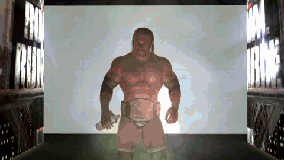
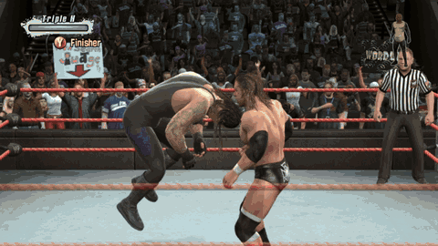
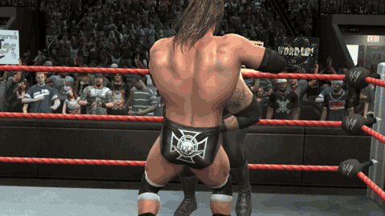

# WWE SmackDown vs. Raw 2009 — native PC & Steam Deck

The Xbox 360 version of **WWE SmackDown vs. Raw 2009**, running natively on Windows and on the
Steam Deck: no emulator. The game's own program is recompiled to run directly on your PC, and its
graphics go through a native Vulkan renderer, at 60 fps and up to 4K.

> **You need your own copy of the game.** None of the files from the game disc are in this project
> or its downloads, and nothing is ever downloaded for you: the game runs from a disc image
> (`.iso`) made from your own SvR 2009 disc. It does not condone piracy: please buy the game.


## Showcase

<p align="center">
  
  
  
</p>

## Features

- **Native, not emulated.** The game's PowerPC code is statically recompiled to x86-64
  ([ReXGlue](https://github.com/rexglue/rexglue-sdk)), and the game's own Direct3D calls are drawn
  by a native Vulkan renderer (adapted from [re:Blue](https://github.com/zolaware/reblue)) with
  the game's shaders recompiled ahead of time. No GPU emulation.
- **60 fps** in menus and matches, using the game's own 60 fps mode so game speed stays right
  (the original 30 fps is one setting away).
- **Up to 4K.** Internal resolution follows your screen: 1440p on 1080p and 1440p monitors, 4K on
  4K monitors, 720p on the Steam Deck. Or pick 720p / 1440p / 4K yourself. 16x anisotropic
  filtering.
- **A simple launcher:** choose your disc image once (it checks it's the right game and release),
  change settings, press Play. Works with a controller, so it's at home on the Steam Deck.
- **Steam Deck** through Proton: 720p at 60 fps, the correct 16:9 shape (or stretched to fill).
- **Faster loading:** matches load in about 20 seconds instead of nearly a minute (the game
  paced its loading for the console's DVD drive).
- **Plays straight from your disc image**: nothing is extracted or installed.
- **Controllers** (Xbox, PlayStation, Switch Pro, the Deck's controls) through SDL; the keyboard
  works as a controller too.

## What you need

- **Your own SvR 2009 disc image**, USA / Europe release (one release for both regions: title ID
  `54510826`, media ID `7AFA4596`, about 7.3 GB). The launcher tells you if yours is a different
  release; those aren't supported yet.
- **Windows 10 or 11, 64-bit**, and a graphics card with **Vulkan** support (AMD, NVIDIA or Intel,
  with a recent driver). Or a **Steam Deck**.
- About 130 MB for the program, plus your disc image.

## Windows: install and play

1. Download `WWE-SVR2009-Native-v<version>-Windows-and-SteamDeck.zip` from the
   [Releases](https://github.com/nefariousjosiah/WWE-SVR2009-Native/releases) page (under
   *Assets*; not *Source code*, which is the developer source).
2. Extract it to a folder of its own, for example `C:\Games\WWE-SVR2009-Native`
   (not inside `Program Files`).
3. Run **`Launcher.exe`** in that folder.
4. Press **Choose disc image...** and pick your `.iso`, wherever it is. The launcher checks it and
   remembers it. (Or copy the `.iso` into the folder: the launcher finds it by itself.)
5. Press **Play**.

Good to know:

- **Settings** (button in the launcher): resolution (Auto, 720p, 1440p, 4K), fullscreen or window,
  60 or 30 fps, screen shape. They are saved in `svr2009.toml`.
- **"Windows protected your PC"**: the program isn't code-signed. Click *More info* and then
  *Run anyway*.
- **Quitting:** close the game window (Alt+F4 or the close button); the launcher comes back.
- **Saves** live in the `userdata` folder. Back it up to keep your career and created superstars.
- **Box art:** the launcher shows the game's cover; drop another image onto it to change it.
- Starting `svr2009.exe` directly works too: it uses the disc image the launcher remembered.

### Controls

A controller is recommended; plug it in before starting. On the keyboard (rebind with **F4** in
game):

| Controller | Keyboard | | Controller | Keyboard |
|---|---|---|---|---|
| A | Space / ; | | Left stick | W A S D |
| B | Backspace / ' | | Right stick | Arrow keys |
| X | L | | D-pad | Shift + arrow keys |
| Y | P | | LB / RB | 1 / 3 |
| Start | Enter / X | | LT / RT | Q / E |
| Back | Tab / Z | | Stick presses | F / K |

**F2** shows or hides the FPS counter.

## Steam Deck: install and play

The Windows release runs on the Deck through Proton, Steam's compatibility layer. It holds 60 fps.

**In Desktop Mode** (press the Steam button, *Power*, *Switch to Desktop*):

1. **Get the release.** Download `WWE-SVR2009-Native-v<version>-Windows-and-SteamDeck.zip`
   (under *Assets*, not *Source code*) with a browser, or copy it from your PC together with your
   disc image. A USB stick for the copy must be **exFAT or NTFS**: the disc image is bigger than
   FAT32's 4 GB file limit.
2. **Extract it.** In the *Dolphin* file manager, make a folder such as
   `/home/deck/Games/WWE-SVR2009-Native`, right-click the zip, *Extract*, *Extract archive to...*,
   and choose that folder. (A microSD card works too.)
3. **Add your disc image.** Copy your `.iso` into that folder. The launcher finds it there.
4. **Add it to Steam.** Open Steam (desktop), then *Games* > *Add a Non-Steam Game to My
   Library...* > *Browse...*. Set the file type filter to *All files*, pick `Launcher.exe` in your
   folder, then *Add Selected Programs*.
5. **Turn on Proton.** In your library, right-click *Launcher* > *Properties...* >
   *Compatibility*, tick *Force the use of a specific Steam Play compatibility tool* and choose
   **Proton Experimental** (or the newest Proton). While you are there, rename the shortcut to
   *WWE SmackDown vs. Raw 2009*.

**Back in Game Mode** (the *Return to Gaming Mode* icon on the desktop):

6. Start it from *Library* > *Non-Steam*. The launcher opens fullscreen and says *Ready to play*:
   press **A** on **Play**. Quitting the game brings you back to the launcher.

Notes for the Deck:

- **The first start** takes a little longer while Proton sets itself up.
- **Black bars:** the game is 16:9 and the Deck's screen is 16:10, so there are thin bars above
  and below. *Settings* > *Screen shape* > *Stretch to fill* removes them (the picture gets a
  little taller).
- **Controls:** the Deck's built-in controls work as an Xbox controller with Steam's default
  layout.
- **Artwork:** Steam's library artwork for the shortcut can be set from its properties.

## Troubleshooting

| What the launcher says | What to do |
|---|---|
| *Choose your disc image* | It hasn't found one yet: press **Choose disc image...**, or copy your `.iso` into the game's folder and press **Look again**. |
| *Different disc release* | Your disc image is another release of the game; only the USA / Europe release is supported so far. |
| *That's a different game* | The file is a disc image of another game: choose your SvR 2009 one. |
| *That file can't be used* | It isn't a complete Xbox 360 disc image (it should be about 7.3 GB). |

| What happens | What to do |
|---|---|
| Black screen, or the game closes | Update your graphics driver (the renderer needs Vulkan), then try again. If it keeps happening, open an issue with `game.log` from the game's folder. |
| It runs slowly | *Settings* > *Resolution* > **720p** or **1440p**: lower resolutions need less from the graphics card. |
| Windows blocks it | *More info* > *Run anyway* (the program isn't code-signed). |

## How it works

- **Recompilation.** [ReXGlue](https://github.com/rexglue/rexglue-sdk) translates the game's Xbox
  360 executable into C++ that is compiled for x86-64. The Xbox 360 system calls it makes are
  provided by the ReXGlue runtime, which also reads the game's data straight from your disc image.
- **Rendering.** Instead of emulating the Xbox 360 GPU, the renderer watches the game's own
  Direct3D library (statically linked into the game) and draws the same scenes through
  [plume](https://github.com/zolaware/plume) on Vulkan. The game's shaders are converted ahead of
  time with [XenosRecomp](https://github.com/zolaware/reblue-XenosRecomp). The emulated GPU only
  keeps the game's command stream moving.
- **60 fps.** The game has its own 60 fps mode, which it normally drops to 30 for matches; a hook
  keeps it at 60, so the game logic and the animations stay in step.

The details, every pitfall included, are in [docs/porting-playbook.md](docs/porting-playbook.md)
and [docs/native-renderer.md](docs/native-renderer.md).

## Building from source

For developers; players use the releases. Windows, with about 30 GB free.

```
git clone https://github.com/nefariousjosiah/WWE-SVR2009-Native.git
cd WWE-SVR2009-Native
powershell -ExecutionPolicy Bypass -File tools\windows\setup.ps1 -Iso "D:\path\to\your disc image.iso"
```

`setup.ps1` installs the tools it needs (Git, CMake, Ninja, LLVM clang, Python, 7-Zip, Visual Studio
2022 Build Tools), fetches the third-party sources at the pinned commits and applies this project's
patches (`patches/`), builds the ReXGlue SDK, extracts your disc image to `assets/`, recompiles
`default.xex` and builds the game.

The native renderer also needs your game's shaders, which can't be in this repository. The first
time, `setup.ps1` builds a shader-dump version and tells you how to collect them: play the menus
and a match or two with shader dumping on, run `tools\native\build_shader_cache.ps1`, then run
`setup.ps1` again.

Afterwards: `tools\windows\build.ps1` rebuilds, `Play WWE 2009.bat` runs it, and
`tools\windows\package_release.ps1 -Version 1.0` makes the release zip (game, launcher, no game
files; the launcher is built with `launcher\build.ps1`).

Repository layout: `src/` the game-specific code (`native/` renderer glue, `reblue/` the renderer),
`launcher/` the launcher, `config/` recompiler configuration, `patches/` changes to the third-party
sources, `tools/` scripts, `docs/` notes.

## Credits

- [ReXGlue SDK](https://github.com/rexglue/rexglue-sdk) by Tom Clay, derived from
  [Xenia](https://xenia.jp): the recompiler and runtime.
- [re:Blue](https://github.com/zolaware/reblue) (Blue Dragon), the renderer this one is adapted
  from, with [plume](https://github.com/zolaware/plume) and
  [XenosRecomp](https://github.com/zolaware/reblue-XenosRecomp).
- The launcher: [SDL](https://libsdl.org), [Dear ImGui](https://github.com/ocornut/imgui),
  [stb_image](https://github.com/nothings/stb), the Roboto font.
- [zstd](https://github.com/facebook/zstd); the Press Start 2P font.

Licences of all of these: [THIRD_PARTY.md](THIRD_PARTY.md).

## Licence and legal

This project's own code is MIT licensed ([LICENSE](LICENSE)). None of the files from the game
disc are in this repository or the releases: the game's data (models, textures, sound, video)
comes from your own disc image. The releases do contain the game's program in recompiled form
(`svr2009.exe`, with the game's shaders converted for PC).

WWE, SmackDown vs. Raw and all related names, characters, content, the box art shown by the
launcher and the gameplay shown in the showcase clips belong to their respective owners (WWE,
THQ, Yuke's); the box art is used only to identify the game, the clips only to show the port
running. This is an unofficial fan project, not affiliated with or endorsed by them or by
Microsoft.
